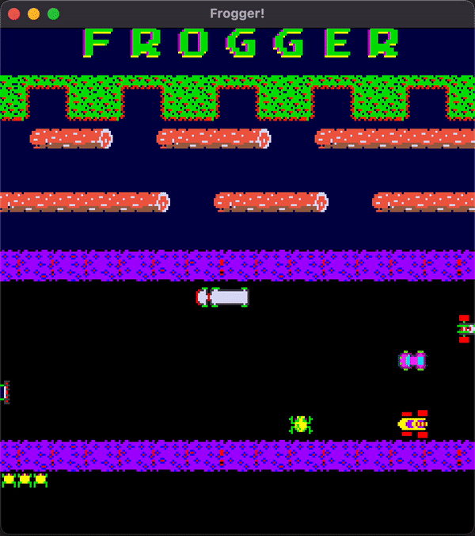

# Frogger

#### CS 8 Final Project | Fall 2020

## How to Run on MacOS

<table>
  <tr>
    <th>CLion</th>
    <th>
      <ul align="left">
        <li>Install CLion</li>
        <li>
          Install SFML using homebrew
          <code>brew install sfml</code>
        </li>
        <li>Clone the Frogger repo</li>
        <li>Make sure that the project is configured to the new project directory in "Run/Debug Configurations"</li>
        <li>Hit the play button</li>
      </ul>
    </th>
  <tr/>
</table>
